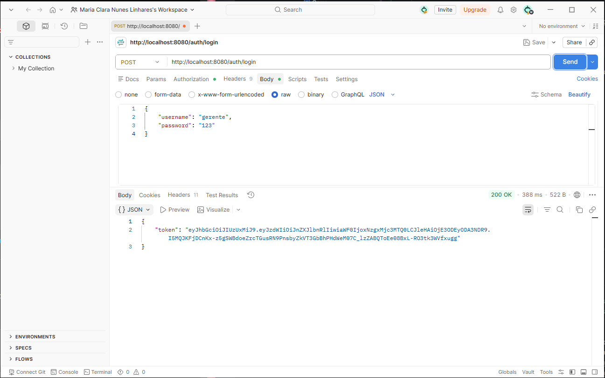
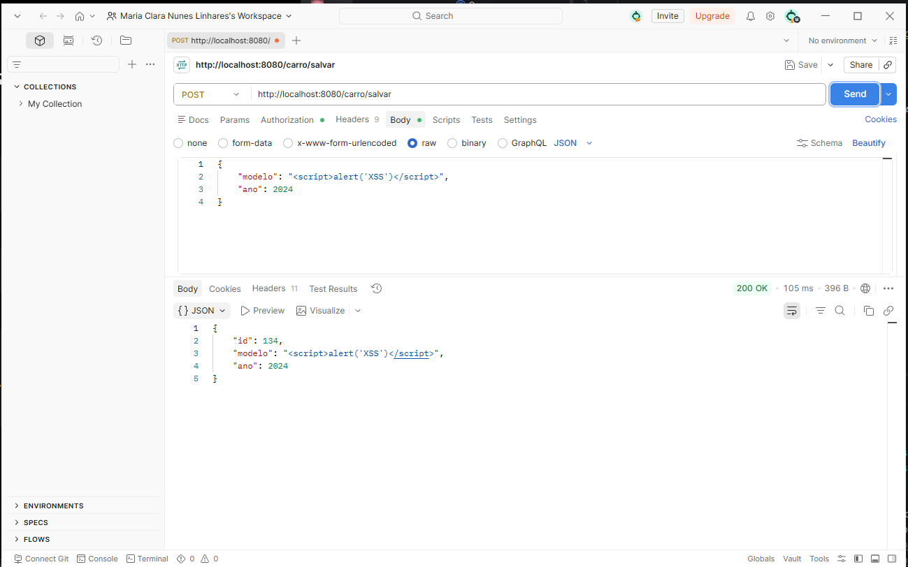
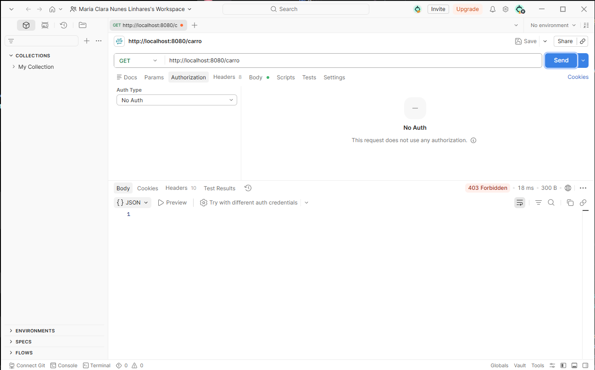
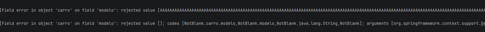
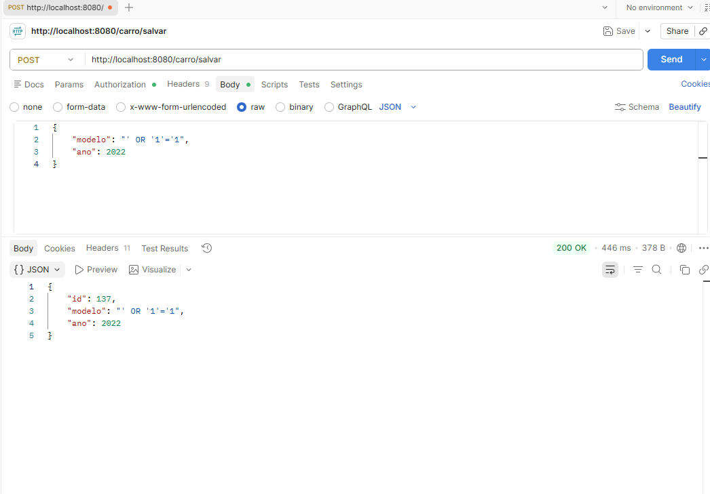
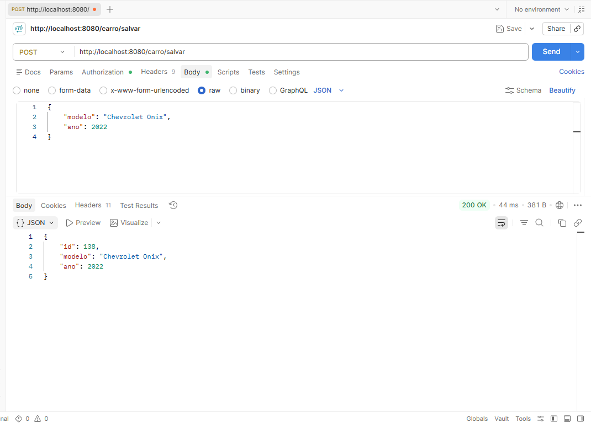
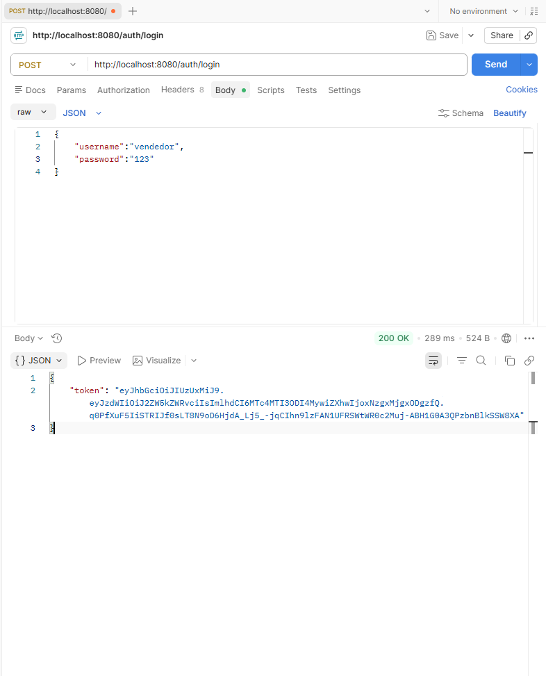
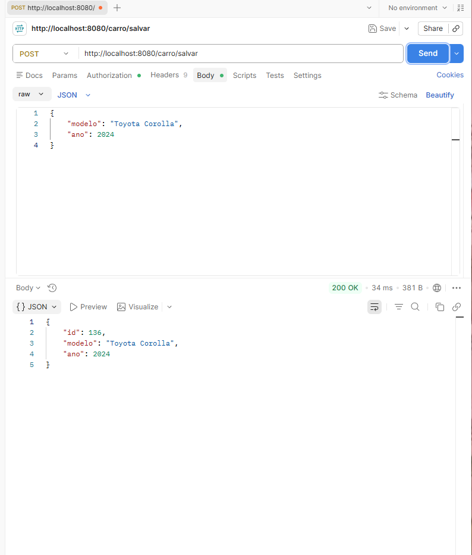
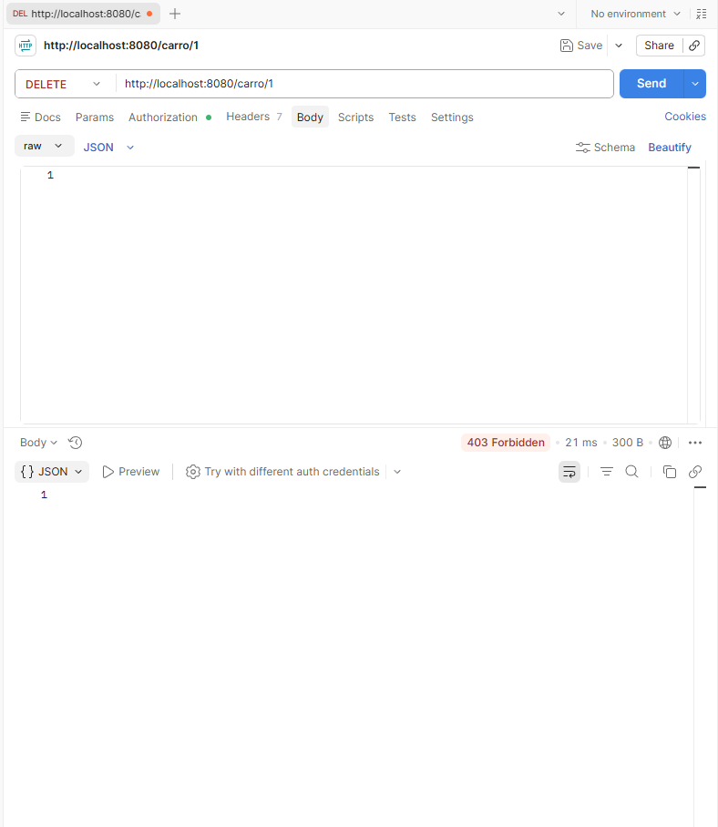

# 🚗 LojaCarro - Implementação de Segurança com JWT


##  Aluno(A)

- Maria Clara Nunes


##  Funcionalidades implementadas

### ✅ Autenticação com JWT

Foi implementado um sistema de autenticação baseado em JSON Web Token.

O usuário realiza o login através do endpoint:

```http
POST /auth/login
```



## Controle de acesso por papéis

Foram definidos dois papéis de usuários:

- `GERENTE`
- `VENDEDOR`

### Permissões implementadas

| Endpoint | GERENTE | VENDEDOR |
|-----------|----------|-----------|
| GET /carro | ✅ | ✅ |
| POST /carro/salvar | ✅ | ✅ |
| PUT /carro/{id} | ✅ | ✅ |
| DELETE /carro/{id} | ✅ | ❌ |
| Cadastro de usuários | ✅ | ❌ |

---

# Testes realizados

## 1. Validação de Entrada (XSS)

### Entrada utilizada



### Resultado

O sistema armazenou a string como texto comum, sem executar o script.

**Conclusão:** não houve execução do código JavaScript no backend.

---

## 2. Acesso Não Autorizado

Foi realizada uma tentativa de acesso aos endpoints protegidos sem enviar o token JWT.

### Exemplo





**Conclusão:** o sistema bloqueou o acesso de usuários não autenticados.

---

## 3. Manipulação de Dados

### 3.1 Strings muito grandes e Campos obrigatórios vazios

Entrada utilizada:

```json
{
    "modelo": "AAAAAAAAAAAAAAAAAAAAAAAAAAAAAAAAAAAAAAAAAAAAAAAAAAAAAAAAAAAAAAAAAAAAAAAAAAAAAAAAAAAAAAAAAAAA",
    "ano": 2022
}
```
```json
{
    "modelo": "Corolla",
    "ano": -1
}
```


Resultado:




## 4. Verificação contra SQL Injection

Foi realizado o teste utilizando entradas maliciosas.

Exemplo:




Resultado:

O sistema tratou o valor como texto simples.

**Conclusão:** a aplicação mostrou-se resistente a SQL Injection, pois utiliza Spring Data JPA, que emprega consultas parametrizadas.

---

## Como executar

### Clonar o projeto

```bash
git clone <https://github.com/claranuneslinhares/TesteLojaCarro.git>
```

### Entrar no projeto

```bash
cd TesteLojaCarro
```

### Executar

```bash
mvn spring-boot:run
```

---

## Exemplos de requisições

### Login

```http
POST /auth/login
```

Body:

```json
{
    "username": "gerente",
    "password": "123456"
}
```

---

### Cadastro de carro

```http
POST /carro/salvar
```

Header:

```text
Authorization: Bearer TOKEN
```




## Testando papel de vendedor

- Realizando login e obtendo token


- Cadastrando carro como vendedor.

- Exclusão de carro como vendedor


## Branch utilizada

```text
SEGURANCA
```


